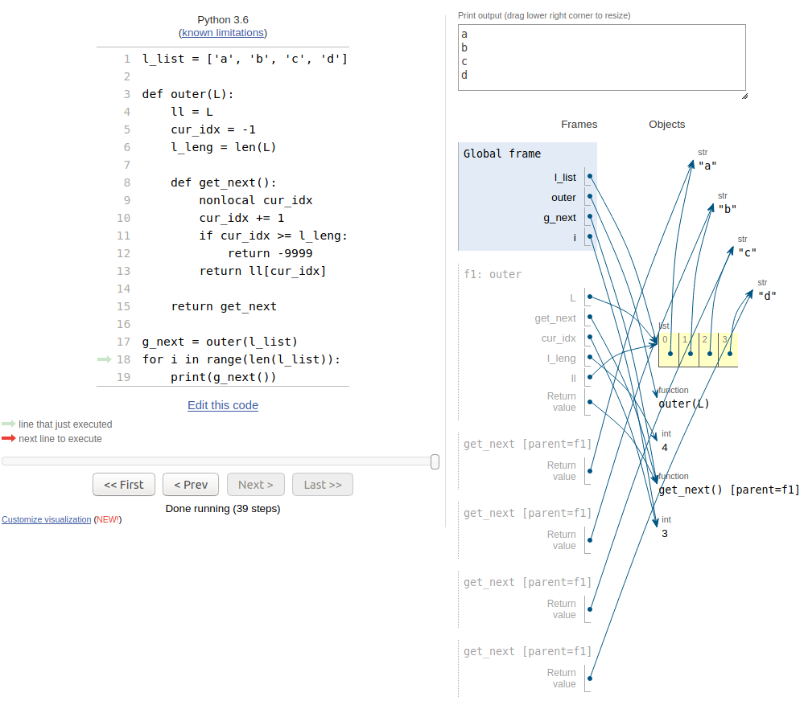

# Iterator
```py
my_iter = iter([1, 2, 3, 4, 5])
while True:
    try: 
        print(next(my_iter))
    except StopIteration:
        break

# or 

for i in my_iter:
    print(i)
```
## Custom Iterator
```py
class GiveMeNext:
    def __init__(self, L):
        super().__init__()
        self.__list = L
        self.__curr_idx = -1
        self.__list_size = len(L)

    def give_me_next(self):
        self.__curr_idx += 1
        if self.__curr_idx >= self.__list_size:
            raise StopIteration
        return self.__list[self.__curr_idx]

my_iter = GiveMeNext([1,2,3,4,5,6])
while True:
    try:
        print(my_iter.give_me_next())
    except StopIteration:
        break
```
```py
class GiveMeNext:
    def __init__(self, L):
        super().__init__()
        self.__list = L
        self.__curr_idx = -1
        self.__list_size = len(L)
    def __iter__(self):
        return self
    def __next__(self):
        self.__curr_idx += 1
        if self.__curr_idx >= self.__list_size:
            raise StopIteration
        return self.__list[self.__curr_idx]

my_obj = GiveMeNext([1, 2, 3, 4, 5, 6])
my_iter = iter(my_obj)
for i in my_iter:
    print(i)
```

# Generator
## Stateful Function
```py
l_list = ['a', 'b', 'c', 'd']
def outer(L):
    ll = L
    cur_idx = -1
    l_leng = len(L)
    def get_next():
        nonlocal cur_idx
        cur_idx += 1
        if cur_idx >= l_leng:
            return -9999
        return ll[cur_idx]
    return get_next

g_next = outer(l_list)
```

[ref : pythontutor.com]((http://pythontutor.com/))

## Generator
```py
l_list = [1, 2, 3, 4, 5]
def gen(L):
    for value in L:
        yield value
g_next = gen(l_list)
for i in g_next:
    print(i)

# w/ error with pytutor...
```
### Things to consider
* garbage collector
    * refernce counting
    * refernce cycle
* heap
* (call) stack

## Generator Expression
```py
# different each other
list(k**3 for k in range(10))  # < memory efficient
list([k**3 for k in range(10)])
```