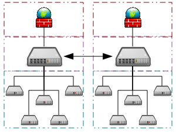

# Matplot
## Stateful vs Stateless
1. Stateless, aka, the "object-oriented (OO), style:
    * Explicitly creates figures and axes, and calls methods on them.
    ```py
    fig, ax = plt.subplots()
    ax.plot(~~~)
    plt.show()
    ```
2. Stateful style:
    * Relies on `pyplot` to automatically create and manage the figures and axes, and uses `pyplot` functions for plotting.
    * Has the notion of the current state of the figure and the axes, and keeps track of them
    ```py
    plt.plot(~~~)
    plt.show()
    ```
## Interactive Mode
* Interactive Mode
    * matplotlib.pyplot.ion() or .ioff() (default)
    * matplotlib.pyplot.isinteractive()
## Input Data Types
* All of  plotting functions expect numpy.ma.masked_arrayor numpy.arrayas input.
    * Classes that are 'array-like' such as pandas data objects and `numpy.matrix` may or may not work as intended.
    * pyplotautomatically converts list/tuple into numpy.array.
    * It is, however, best to convert these, including Python list, to numpy.arrayobjects prior to plotting.
## ETC
* pie plot
    * shadow, explode, autopct, wedgeprops, ...
* Polar Chart(polar axis)
* axs[0][1].set_axis_off()
* plt.subplot(339); plt.plot(~~)
* plt.subplot(335); plt.plot(~~)
* fig = plt.figure(); ax1 = plt.subplot(221); ...

# Threads and Processes
* Threads are also called light-weight processes/tasks
* A process can have multiple threads in it
* number of Threads $\geq$ number of Processes
* Processes do not share their address spaces with other processes
  * They cannot access other processes’s objects
  * Need a permission between precessers to do that
* Threads within a process share the same address space of the process
  * However, they cannot access other threads’ thread-local objects 
* Couroutines are Threads with Co-Operative (i.e., Non-Preemptive) Scheduling
# IPC(Inter-Process communication)

* Shared-Memory Access allows for directly accessing objects in a memory
* IPC requires 
  1. converting, at the sender, the `raw` objects into a byte stream to be transmitted over an `IPC wire`, and 
  2. then converting, at the receiver, the received byte stream back to the `raw` objects. 
* This process of converting from the `raw` objects is called `serialization`(or, `marshalling`), and the process of converting back into the `raw` objects is called `deserialization`(or, `unmarshalling`) of objects.

## Problem
```py
import sys
import threading
NUM_THREADS = 5
counter = 0
class MyThread(threading.Thread):
    def __init__(self, name, id):
        global counter
        threading.Thread.__init__(self)
        self._id = id
        self._name = name
        print_event(self._name, self._id, 'Created', counter)
    def run(self):
        global counter
        print_event(self._name, self._id, 'Starting', counter)
        for j in range(int(sys.argv[1])):
            counter += 1
        print_event(self._name, self._id, 'Exiting', counter)
def print_event(name, id, event, counter):
    print(f"{name:<0}[{id:<0] {event:<10} with counter = {counter}")
threads = [MyThread('Thread', i) for i in range(NUM_THREADS)]

print('')
for i in range(NUM_THREADS):
    threads[i].start()

for i in range(NUM_THREADS):
    threads[i].join()  # wait until the threads terminate, then the main terminates
```

## Correct
```py
import sys
import threading
NUM_THREADS = 5
counter = 0
lock = threading.Lock()
class MyThread(threading.Thread):
    def __init__(self, name, id):
        global counter
        threading.Thread.__init__(self)
        self._id = id
        self._name = name
        print_event(self._name, self._id, 'Created', counter)
    def run(self):
        global counter
        global lock
        lock.acquire(True)
        print_event(self._name, self._id, 'Starting', counter)
        for j in range(int(sys.argv[1])):
            counter += 1
        print_event(self._name, self._id, 'Exiting', counter)
        lock.release()

def print_event(name, id, event, counter):
    print(f"{name:<0}[{id:<0] {event:<10} with counter = {counter}")
threads = [MyThread('Thread', i) for i in range(NUM_THREADS)]

print('')
for i in range(NUM_THREADS):
    threads[i].start()

for i in range(NUM_THREADS):
    threads[i].join()  # wait until the threads terminate, then the main terminates
```